# Traffic sign classification with deep learning

### 1, Main objective of the analysis that also specifies whether your model will be focused on a specific type of Deep Learning or Reinforcement Learning algorithm and the benefits that your analysis brings to the business or stakeholders of this data.
Nowadays, Artificial Intelligence applications can be found almost everywhere, when we are using mobile phones, computers, cars or social media platforms. This time, I would like to focus on the automotive applications with deep learning approaches. I have found a so-called traffic signs dataset on Kaggle, which consists of various types of traffic signs along with their labels. The main objective of this task to build up a suitable deep learning architecture to classify each of the traffic signs.

### 2, Brief description of the data set you chose, a summary of its attributes, and an outline of what you are trying to accomplish with this analysis.

The dataset what I have chosen can be found on Kaggle: <https://www.kaggle.com/datasets/valentynsichkar/traffic-signs-preprocessed?resource=download&select=datasets_preparing.py>

The entire database consists of 51839 samples. These samples are classified into 43 different classes. The train, validation and test sets are available separately in pickle file format.

Number of samples in the pickles:

- train: 34799
- validation: 4410
- test: 12630

The labels are stored in sparse categorical format in the pickle files, so we have to apply a number to label mapping if we would like to see the meanings of the categories. The mapping table can be found in the label\_names.csv file.

Some of the attributes are listed below:

|**ClassID**|**SignName**|
| :-: | :-: |
|0|Speed limit (20km/h)|
|1|Speed limit (30km/h)|
|9|No passing|
|10|No passing for vehicles over 3.5 metric tons|
|11|Right-of-way at the next intersection|
|12|Priority road|
|13|Yield|
|14|Stop|

### 3, Brief summary of data exploration and actions taken for data cleaning or feature engineering.

First of all, I wanted to see what the content of the pickle files are, so I printed out some train examples. The pictures are colored and have 32x32 dimensions. I suppose the classification task will be quite challenging due to shady and blurry low-resolution pictures.

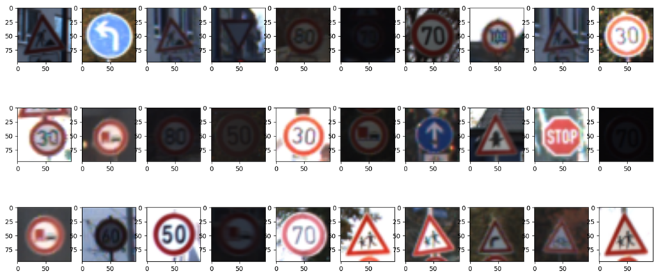

As a second step, I generated histograms about the class distributions according to the train, validation and test sets. The x-axis represents the classes and y-axis represents the number of samples.

|**Train**|**Val**|**Test**|
| :-: | :-: | :-: |
|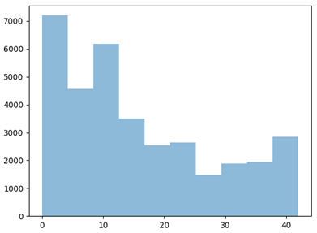|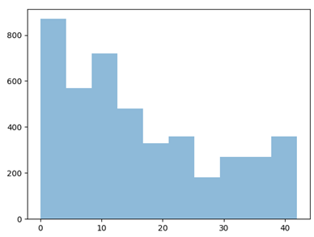|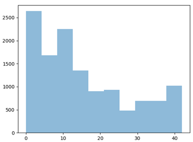|

After a short analysis we can see, that we have to deal with an imbalanced dataset, so I have implemented a BalancedDataGenerator class which is able to generate balanced batches. The underlying function is a RandomOverSampler which oversamples the minority classes and makes perfectly balanced batches.

Some of the images have too low or high contrast values, so it should be corrected somehow. For this purpose, I applied histogram equalization to get more visible and interpretable road signs.

|**Original**|**Corrected**|
| :-: | :-: |
|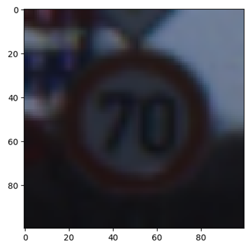|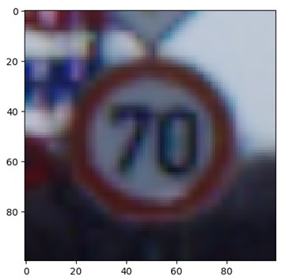|

In terms of the LeNet5 architecture, it is suggested to provide grayscale pictures as input with only one color channel. Therefore, I have applied an rgb_to_grayscale transformation on the entire dataset and resized the pictures from 32x32 to 60x60. Finally, I normalized the pixel values between 0 and 1.

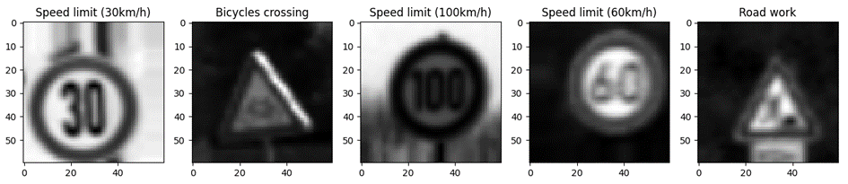

### 4, Summary of training at least three variations of the Deep Learning model you selected. For example, you can use different clustering techniques or different hyperparameters.

|**Model**|**Input Size**|**Batch size**|**Steps per epoch**|**Total/Trainable Parameters**|**Train Acc.**|**Validation Acc.**|**Test Acc.**|
| :-: | :-: | :-: | :-: | :-: | :-: | :-: | :-: |
|LeNet5\_Custom|60x60|32|500|2,322,431|98\.49%|97\.07%|95\.62%|
|AlexNet\_Custom|130x130|32|300|36 577 739/36 577 115|97\.93%|97\.30%|94\.99%|
|VGG16|120x120|32|500|14 714 688/12 979 200|93\.36%|88\.48%|86\.86%|
|**InceptionV3**|**130x130**|**32**|**300**|**21 802 784/21 768 352**|**98.57%**|**96.67%**|**96.35%**|

### Comparison of the investigated DL models:

**Custom LeNet5:**

|**Layer**|**Feature Map**|**Size**|**Kernel Size**|**Stride**|**Activation**||
| :-: | :-: | :-: | :-: | :-: | :-: | :- |
|Input|Image|1|60x60|-|-|-|
|1|Convolution|6|60x60|5x5|1|ReLu|
|2|Max Pooling|6|30x30|2x2|2|-|
|3|Convolution|16|30x30|5x5|1|ReLu|
|4|Max Pooling|16|15x15|2x2|2|-|
|4|Convolution|120|15x15|5x5|1|ReLu|
|5|FC|-|84|-|-|ReLu|
|6|FC Dropout(0.1)|-|84|-|-|-|
|7|FC|-|43|-|-|SoftMax|

|**Model accuracy**|**Confusion matrix**|
| :-: | :-: |
|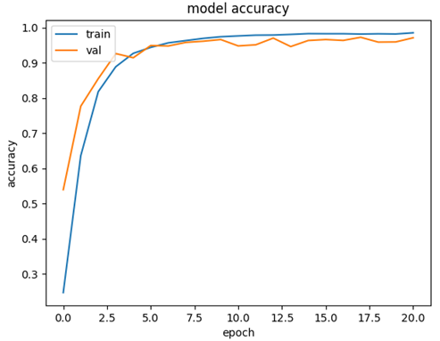|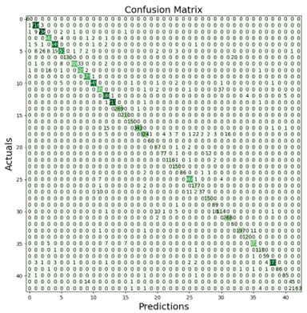|

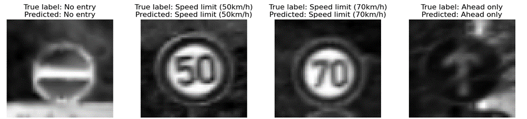

**Custom AlexNet:**

|**Layer**|**Feature Map**|**Size**|**Kernel Size**|**Stride**|**Activation**||
| :-: | :-: | :-: | :-: | :-: | :-: | :- |
|Input|Image|1|130x130|-|-|-|
|1|Convolution|24|63x63|5x5|2|ReLu|
|2|Max Pooling|24|31x31|3x3|2|-|
|3|BatchNorm.||31x31|||-|
|4|Convolution|48|31x31|5x5|1|ReLu|
|5|Max Pooling|48|29x29|3x3|1|-|
|6|BatchNorm.||29x29|||-|
|7|Convolution|96|29x29|3x3|1|ReLu|
|8|BatchNorm.||29x29|||-|
|9|Convolution|96|29x29|3x3|1|ReLu|
|10|BatchNorm.||29x29|||-|
|11|Convolution|48|29x29|3x3|1|ReLu|
|12|BatchNorm.||29x29|||-|
|13|Max Pooling|48|27x27|3x3|1|-|
|14|FC|-|1024|-|-|ReLu|
|15|FC Dropout(0.1)|-|1024|-|-|-|
|16|FC|-|512|-|-|ReLu|
|17|FC|-|43|-|-|SoftMax|

|**Model accuracy**|**Confusion matrix**|
| :-: | :-: |
|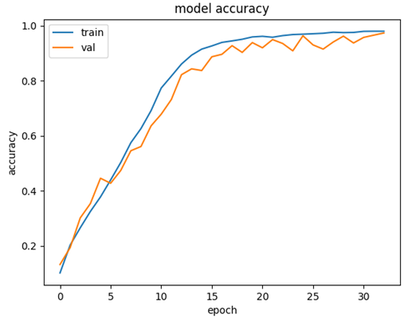|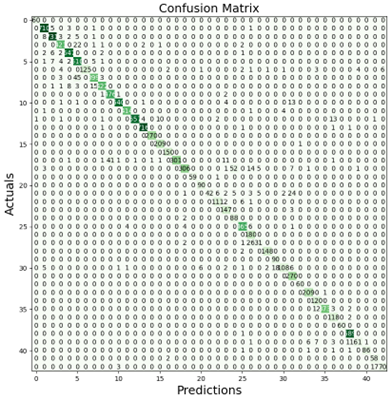|

**VGG 16 with fully connected layers:**

|**Layer**|**Feature Map**|**Size**|**Kernel Size**|**Stride**|**Activation**||
| :-: | :-: | :-: | :-: | :-: | :-: | :- |
|Input|Image||120x120|-|-|-|
|Output|VGG16 output|512|3x3|-|-|-|
|1|FC |-|128|-|-|Relu|
|2|FC|-|43|-|-|SoftMax|

|**Model accuracy**|**Confusion matrix**|
| :-: | :-: |
|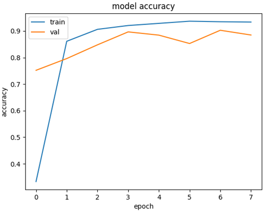|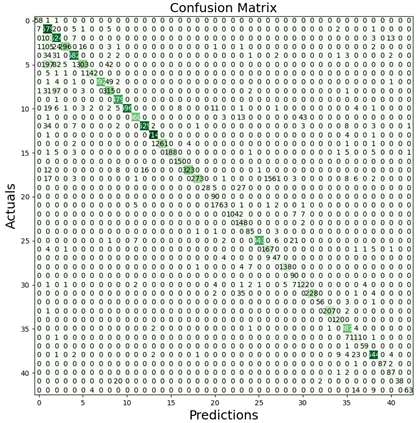|

**InceptionV3 with transfer learning:**

|**Layer**|**Feature Map**|**Size**|**Kernel Size**|**Stride**|**Activation**||
| :-: | :-: | :-: | :-: | :-: | :-: | :- |
|Input|Image||130x130|-|-|-|
|Output|InceptionV3 output|2048|2x2|-|-|-|
|1|FC |-|128|-|-|Relu|
|2|FC|-|43|-|-|SoftMax|

|**Model accuracy**|**Confusion matrix**|
| :-: | :-: |
|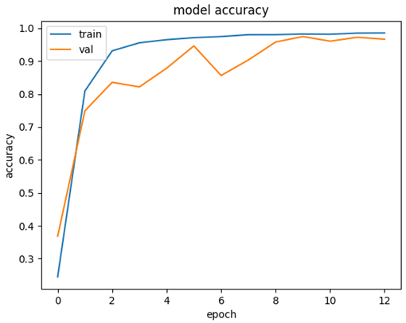|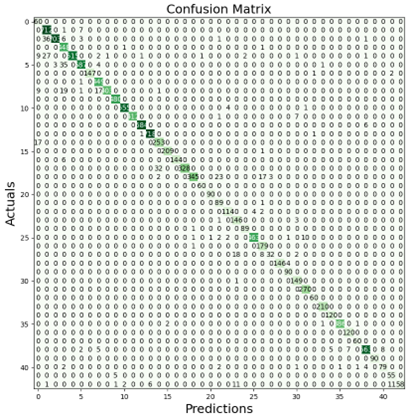|

### 5, A paragraph explaining which of your Deep Learning models you recommend as a final model that best fits your needs in terms of accuracy or explainability.

Based on the comparison of the deep learning models (Table 4.0) , we can clearly see that InceptionV3 was the best model for this classification task. Basically, this model was trained on ImageNet dataset, but based on my experiences I could reach better performance with full re-training on the traffic sign dataset. This model has 96.35% accuracy on test set and 98.57% on the training set.

Besides the InceptionV3 model, my customized LeNet5 could achieve nearly the same results with 95.62% test accuracy and 98.49% train accuracy.

The difference between the test accuracies is less then 1%, but we should keep in mind, that LeNet5 is a much smaller and faster than InceptionV3. So, I would recommend both models, but maybe LeNet5 is the best choice.

### Summary Key Findings and Insights:

If we focus on the data exploration step, we can determine, that the dataset is strongly imbalanced and the resolution of the pictures are very low. Some of the pictures have too low or too high contrast values. I made some measures to improve the resolution and correct the contrast values.
I implemented a balanced\_data\_generator, which can generate balanced batches during training. As a preprocessing step, I applied histogram equalization on the pictures to avoid inappropriate contrast values.

In terms of the deep learning models, the InceptionV3 model had the best accuracy, but it took so much time to train due to roughly 21 million trainable parameters. I was surprised, when I realised if I re-train more layers, the model achieves better score. Finally, I re-trained the entire InceptionV3 model on the traffic signs dataset and that gave me the best performance.

If we take a look at the confusion matrices, we can notice that distinguishing the speed limit tables was the most challenging task. I highlighted some examples in the following table. 

**Most challenging categories based on the confusion matrix:**
|**Speed limit (80km/h)**|**Speed limit (60km/h)**|
| :-: | :-: |
|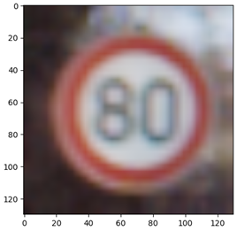|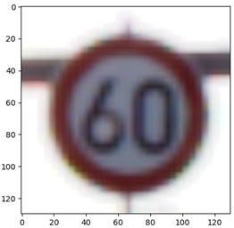|
|**End of no passing**|**End of no passing by vehicles over 3.5 metric tons**|
||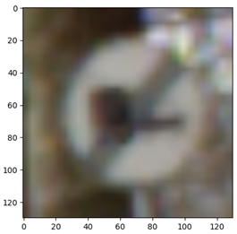|

### 7, Suggestions for next steps in analyzing this data, which may include suggesting revisiting this model or adding specific data features to achieve a better model.

Since the accuracy of the best model on the test set is roughly 96%, I think there is no room for big improvements. Maybe some augmentations would increase the classification performance. With respect to the model architectures, we could fine tune the existing parameters. In my case, I didn’t have a quite powerful graphics card and I couldn’t train these networks on large images. Regarding to the customized networks, I would play around with some new activation functions.